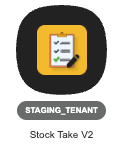
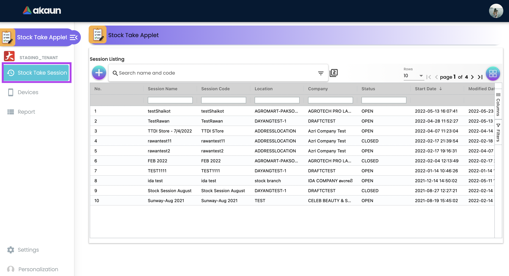
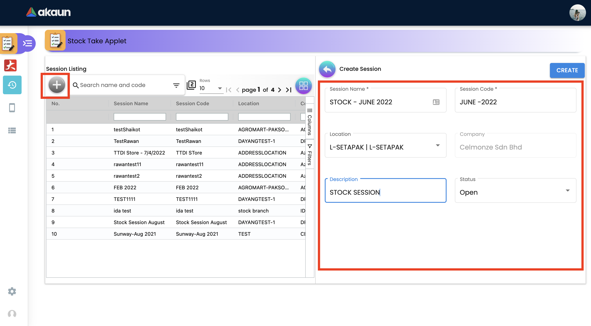
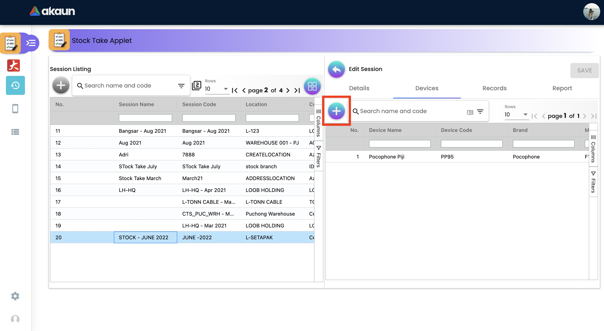
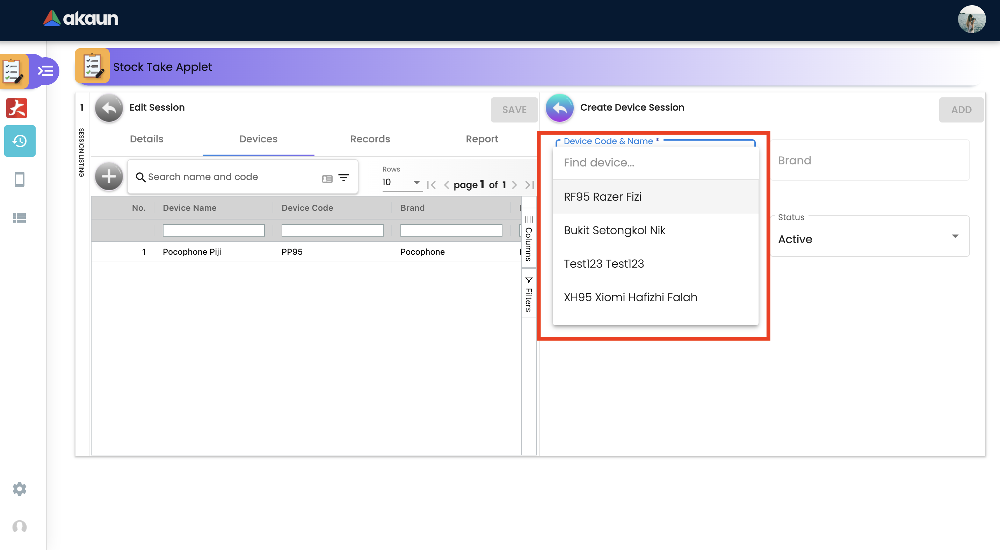
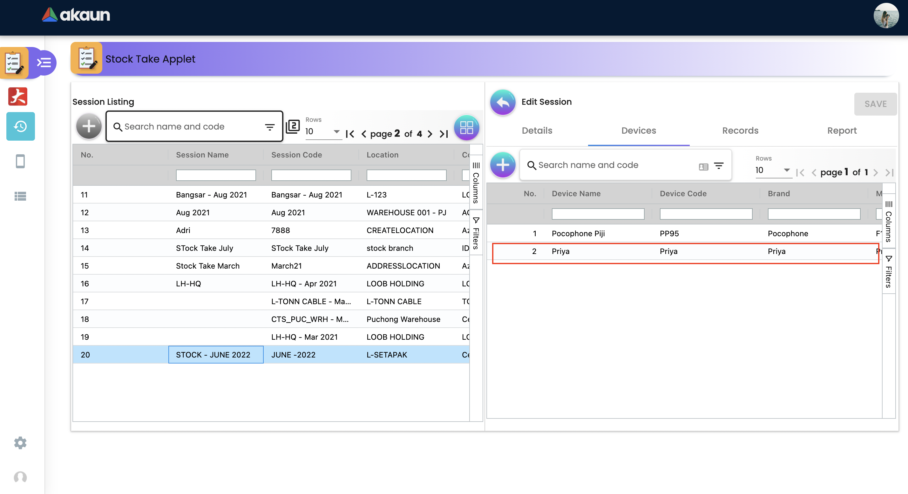

[#h4_stock_take_v2_sales_order_listing]
===== Menu 01 - Stock Take Session

1.1 Please go to Akaun.com - Stock Take Applet V2

1.2 Go to the Stock Take Session

1.3 Create a Stock Take Session Ex: STOCK - JUNE 2022

1.4 After creating the Stock Session, go to devices tab to add PIC for handling the Stock Take

1.5 Find a PIC name to add under the created stock take Session

1.6 After selecting the PIC, go to the PIC name to start performing your Stock Take

1.7  Once click into devices, please go to Records Tab

image::assets/records_tab..png[]

