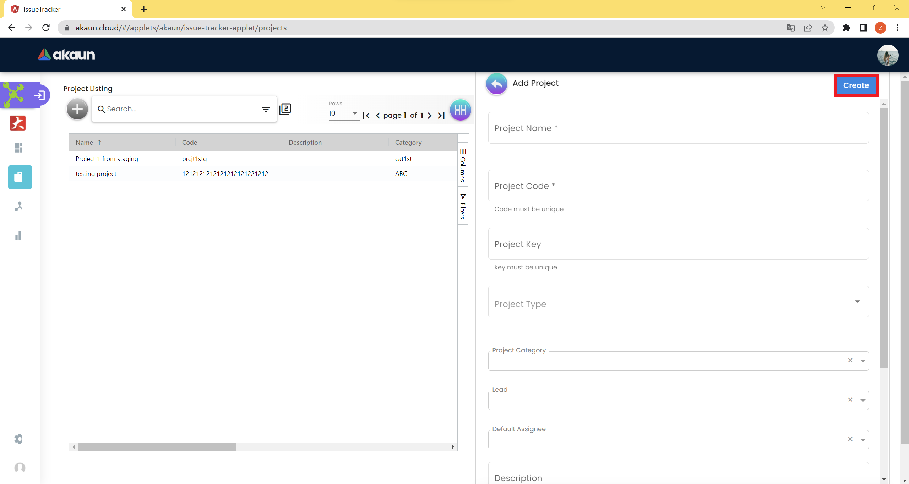

=== *2.1 Dashboard*

The Dashboard shows all the data that is relevant to the projects and
issues, it also provides many graphs for the user to analyze the current
situation easily.

=== *2.2 Projects*

_Projects: Main_

When the user first opens the Projects page, this is the first page that
shows up called *Project Listing Page*. Users can view all the current
projects from this page.

==== *2.2.1 Create*

_Projects: Create_

Users can create a new project on this page. First, they need to click
the “+” button to open a new project.

_Projects: Create Table_

Users need to fill in relevant details on each row. Please be noted if
there is a * sign in specific columns. In those columns, users must
provide the relevant details otherwise the project cannot be created.
Please note that the value in the * row cannot be changed after
creating.

Firstly, users need to add Project Name, Project Code, Project Key,
Project Type, Project Category, Lead Default Assignee, and Description.
Users can also provide an URL link if there is one. Lastly, users can
also choose file or avatar they desire.

After clicking the “Create” button, the project will be created and shown on the main listing page.

==== *2.2.2 Edit*

_Projects: Edit_

If the user wants to change the project detail, they can open the detail
edit table by clicking the project row from the user listing.

==== *2.2.2.1 Details*

image:../images/project_edit_table.png[image,width=624,height=333]

_Projects: Edit Details_ +
The editing table allows the user to edit or delete the current project.
It also consists of three sidebars which are Details, People, and Issue
Types.

The Details page displays all the details filled in at the creation
time. The user is allowed to edit Project Name, Project Key, Project
Type, Project Category, Lead Default Assignee, and Description.

==== *2.2.2.2 Projects*

_Projects: People_

The People tab allows you to view who are the people working on this
project. Also, you may search for someone by typing their name or
username.

==== *2.2.2.2.1 Create*

_Projects: People Create_

The create button allows you to add new user(s) to the project.

_Projects: People Create Information_

When you click on the create button, this page will appear, which allows
you to choose users to add to the project, choose the rank, and write a
description. Lastly, click on + ADD USER(S) to add the user(s).

==== *2.2.2.2.2 Edit*

_Projects: People Edit_

You can click on a user row to edit the user information.

_Projects: People Edit Information_

When you click on the user row, you can view the username, and edit the
rank and description.

==== *2.2.2.3 Issue Types*

image:../images/project_issue_types.png[image,width=624,height=293]

_Projects: Issues Type_

The Issue Types tab allows you to view issue types on the project. Also,
you may search for the issue type by typing its name or code.

==== *2.2.2.3.1 create*

_Projects: Issue type Create_

The create button allows you to add new Issue Type(s) to the project.

_Projects: Issue Type(s) Create Information_

When you click on the create button, this page will appear, which allows
you to choose issue types to add to the project, and write a
description, lastly, click on + ADD ISSUE TYPE(S) to add the issue
type(s).

==== *2.2.2.3.2 edit*

_Projects: Issue Type Edit_

You can click on an issue type row to edit the issue type information.

_Projects: Issue Type Edit Information_

When you click on the user row, you can view the issue type name, and
edit the description.

==== *2.2.3 Search*

image:../images/project_search.png[image,width=624,height=293]

_Projects: Search_

You can search for a project by Project Name, Project Code, Project
Category Code, and Date Created.

