=== *2.3 Issues*

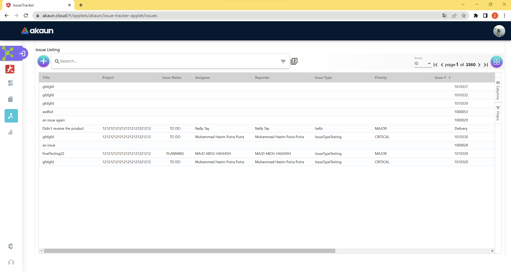

_Issues: main_

When the user switches to the tab Issues, this issue listing will be
shown up. All the issues will be listed down here.

==== *2.3.1 Create*

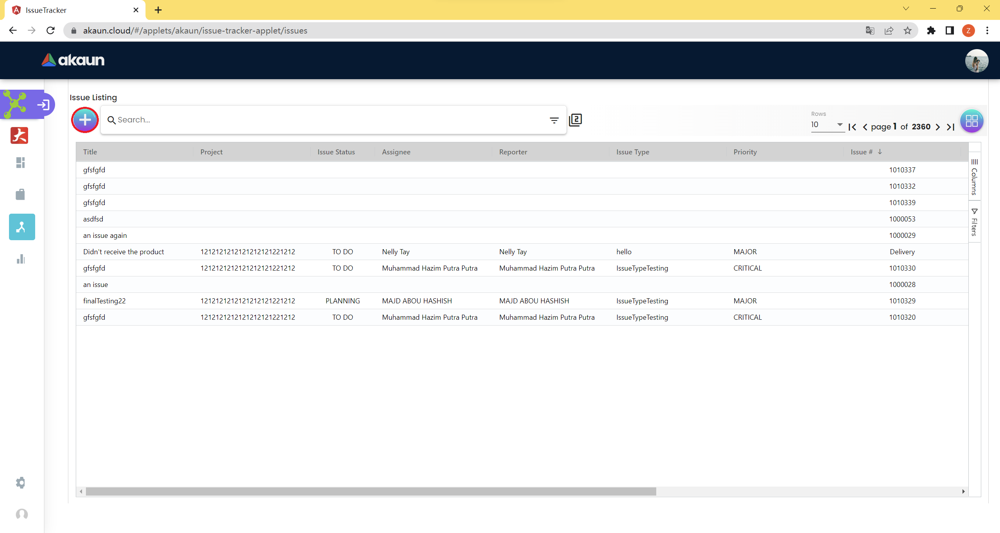

_Issues: Create_

The user can click the “+” button to create a new issue.

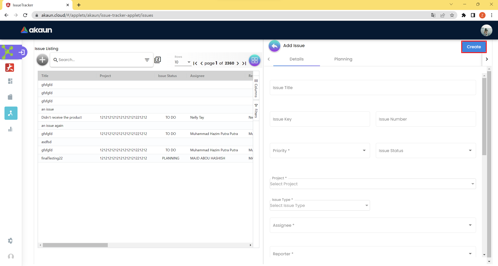

_Issues: Create table_

There are two tabs on the “Add Issue” page, Details and Planning to be
filled.

Fields in Details tab that are needed to be filled:

* Issue Title
* Issue Key
* Issue Number
* Priority
* Critical
* Major
* Minor
* Trivial
* Blocker
* Blank
* Project
* Issue Type
* Assignee
* Reporter
* Company
* Branch
* Store
* Profit Center
* Segment
* Dimension
* Contact
* Description
* Summary

Fields in Details tab that are needed to be filled:

* Target Start Date
* Target End Date
* Actual Start Date
* Actual End Date
* Calculated Start Date
* Calculated End Date
* Baseline Start Date
* Baseline End Date
* Billing Currency
* Billing Amount
* Cost Currency
* Cost Amount
* Story Point
* Manday Target
* Manday Actual
* Manday Allocation
* Manday Billing

After filling in all the required details, the user needs to click the
“Create” button which is on the top right corner to create the new
issue.

==== *2.3.1.1 Details*

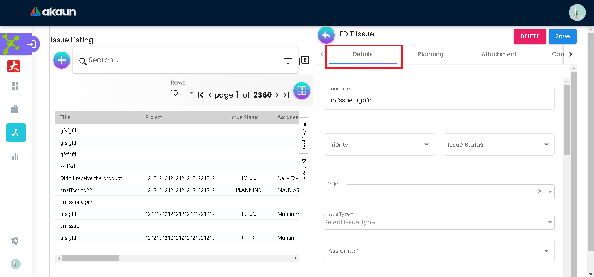

_Issues: Details tab_

On this page, the user needs to provide the needed information about the
issue, the issue title, issue key, issue number, priority, issue status,
project, issue type, assignee, reporter, company, branch, store, profit
center, segment, dimension, contact, description, and summary.

==== *2.3.1.1 Planning*

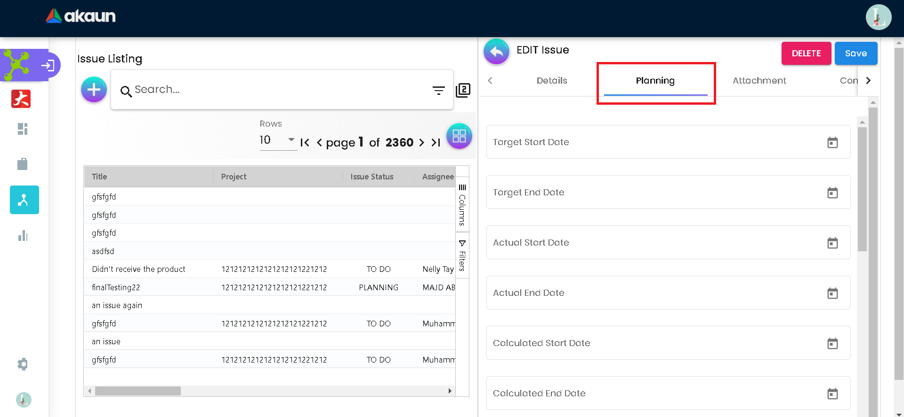

_Issues: Planning tab_

On this tab, the user needs to add needed information about the issue
planning, Target Start Date, Target End Date, Actual Start Date, Actual
End Date, Calculated Start Date, Calculated End Date, Baseline Start
Date, Baseline End Date, Billing Currency, Billing Amount, Cost
Currency, Cost Amount, Story Point, Manday Target, Manday Actual, Manday
Allocation, and Manday Billing.

==== *2.3.2 Edit*

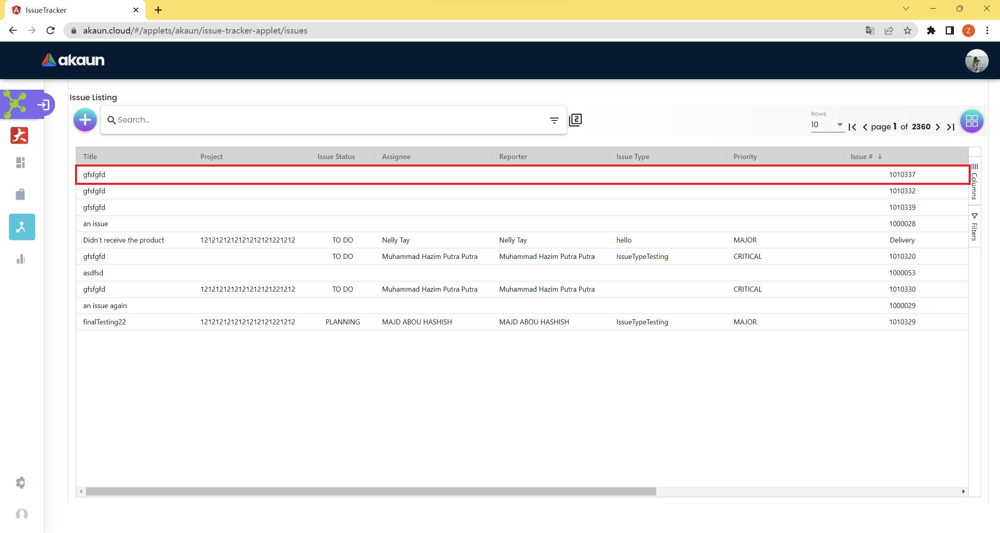

_Issues: Edit_

Users can open the edit page of the specific issue by clicking on it.

_Issues: Edit table_

There are multiple tabs on the “EDIT Issue” page, Details, Planning,
Attachment, Comment, Subtasks, Linked Issues, Worklog, and Activity.

After the user finishes the change, do not forget to click “Save” which
is on the top right corner to save the changes.

==== *2.3.2.1 Details*

_Issues: Edit Details Tab_

On this tab, the user can edit information about the issue details, the
issue title, issue key, issue number, priority, issue status, project,
issue type, assignee, reporter, company, branch, store, profit center,
segment, dimension, contact, description, and summary.

==== *2.3.2.2 Planning*

_Issues: Edit Planning Tab_

On this tab, the user can edit information about the issue planning,
Target Start Date, Target End Date, Actual Start Date, Actual End Date,
Calculated Start Date, Calculated End Date, Baseline Start Date,
Baseline End Date, Billing Currency, Billing Amount, Cost Currency, Cost
Amount, Story Point, Manday Target, Manday Actual, Manday Allocation,
and Manday Billing.

==== *2.3.2.3 Attachment*

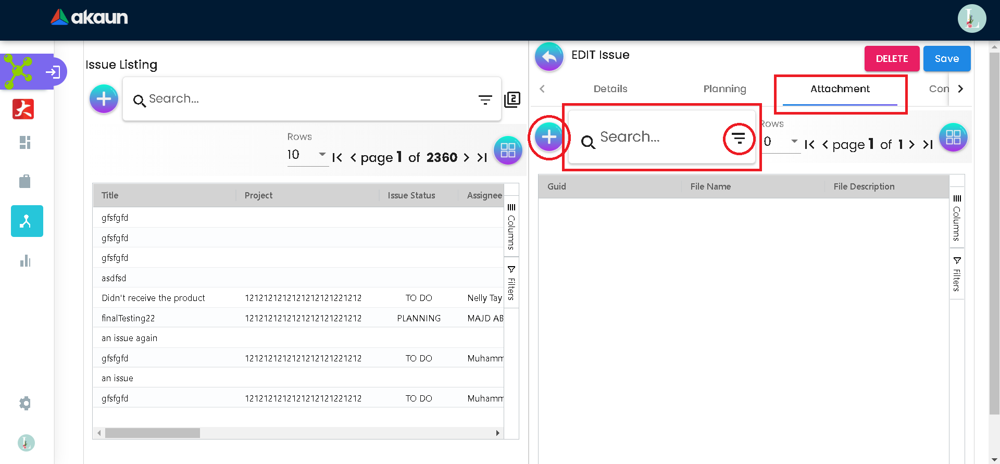

_Issues: Edit Attachment Tab_

On this tab, the user can add attachments to the issue by clicking on
the + Sign on the left of the tab. Moreover, the user can search for
attachments by the file name.

==== *2.3.2.3.1 Add*

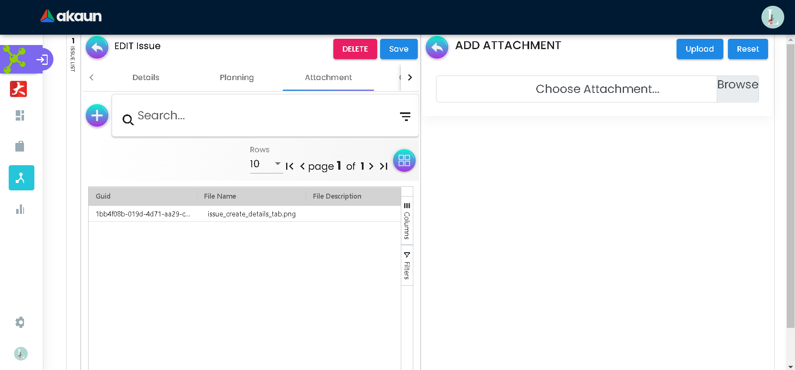

_Issues: Edit Attachment Add Tab_

On add attachment tab, you can add an attachment to the issue by
choosing from your files, or clicking and dropping to the attachment.

==== *2.3.2.3.1 Edit*

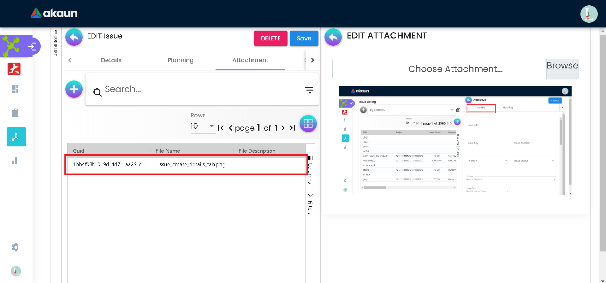

_Issues: Edit Attachment Edit Tab_

You can click on the record of the attachment you want to edit the
attachment, and choose another file.

==== *2.3.2.4 Comment*

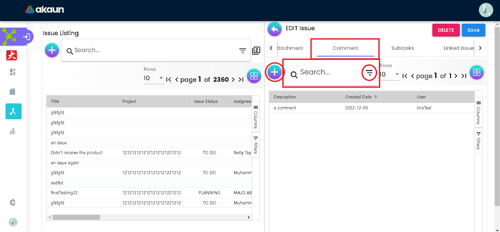

_Issues: Edit Comment Tab_

On the Comment tab, you can see the comments on the issue. You can
search for a specific comment by the comment description. You can create
new comments by clicking on the + button.

==== *2.3.2.4.1 Add*

_Issues: Edit Comment Add Tab_

You can add a description and attachment to the comment and then click +
ADD COMMENT.

==== *2.3.2.4.1 Edit*

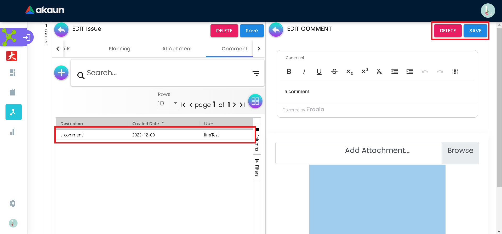

_Issues: Edit Comment Edit Tab_

You can click on an issue comment row to edit the comment by changing
the description and attachment, or delete the comment.

==== *2.3.2.5 Subtasks*

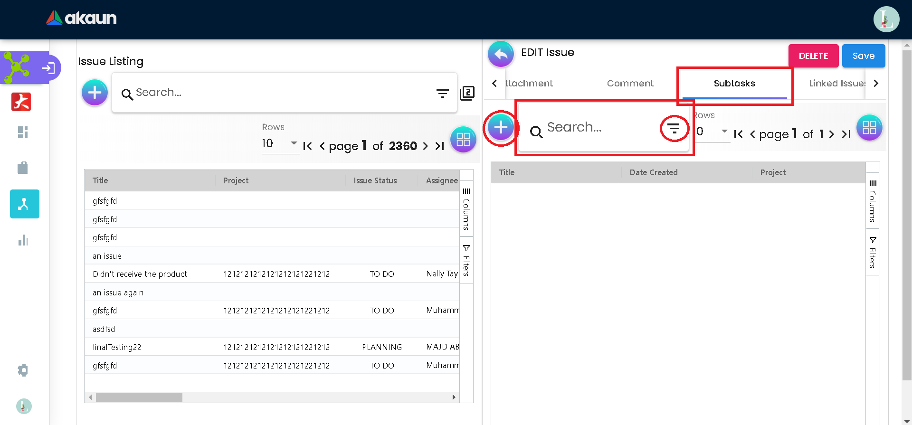

_Issues: Subtasks Tab_

On the subtasks tab, you can see the subtasks related to the issue. You
can search for a subtask by subtask title and date created. You can
create, or add a subtask to the issue by clicking on the + button.

==== *2.3.2.5.1 Add*

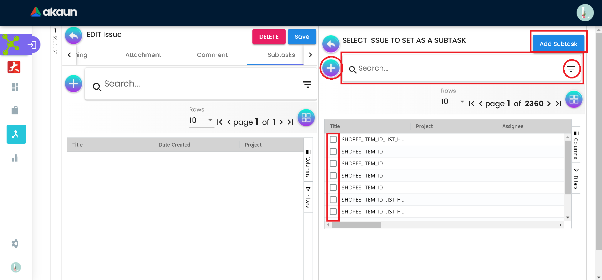

_Issues: Subtasks Add Tab_

On the subtasks add tab, you can select subtasks to add then press the
Add Subtask button, or you can search for specific subtasks by subtask
title or date created. You can add new subtasks by clicking on the +
button.

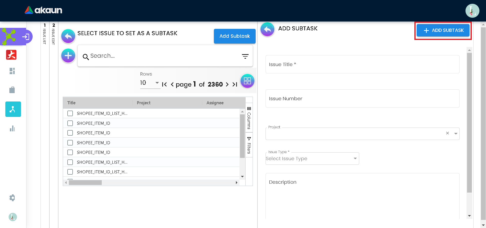

_Issues: Subtasks Add Tab_

On subtasks add subtasks, you can add a new subtask by entering the
issue title, issue number, project, issue type, and description.

==== *2.3.2.6 Linked Issues*

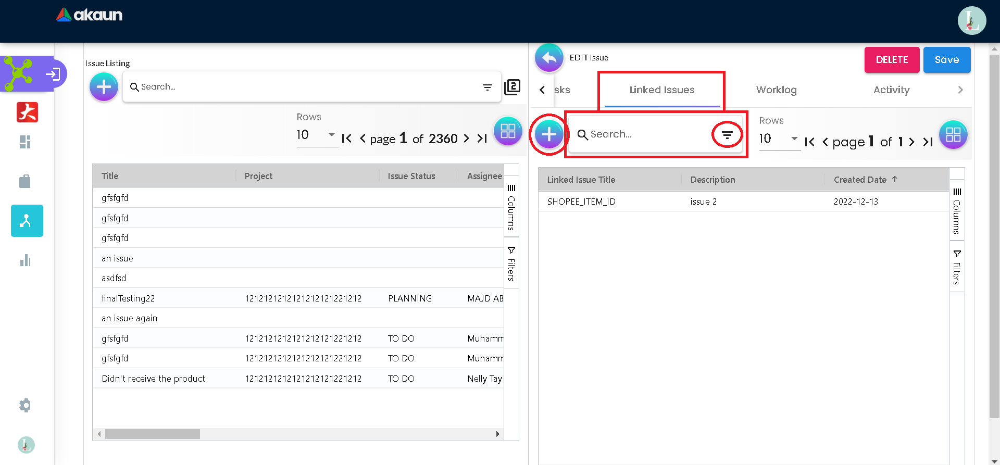

_Issues: Linked Issues Tab_

On the linked issues tab, you can see the linked issues related to the
issue. You can search for a linked issue by the linked issue title and
date created. You can create, or add a linked issue to the issue by
clicking on the + button.

==== *2.3.2.6.1 Add*

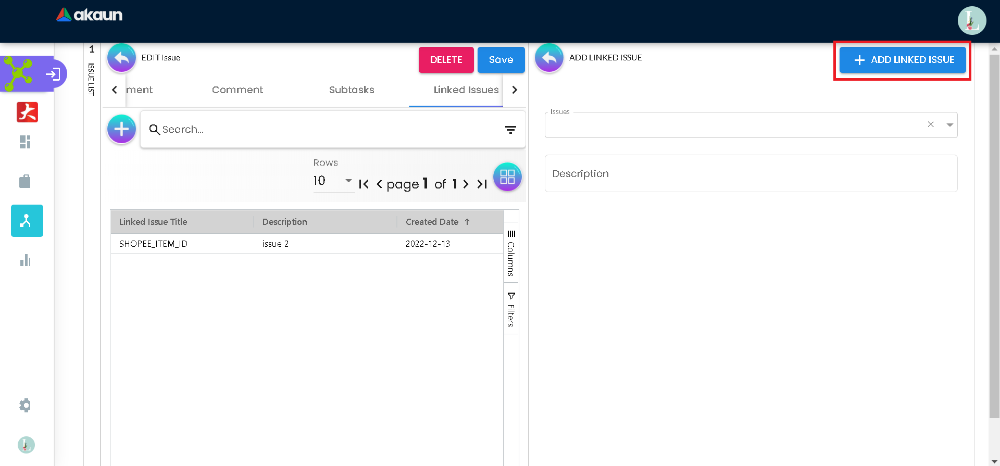

_Issues:_ linked issues _Add Tab_

On linked issues add linked issues, you can add new linked issue(s) and
add a description to the linked issues.

==== *2.3.2.7 Worklog*

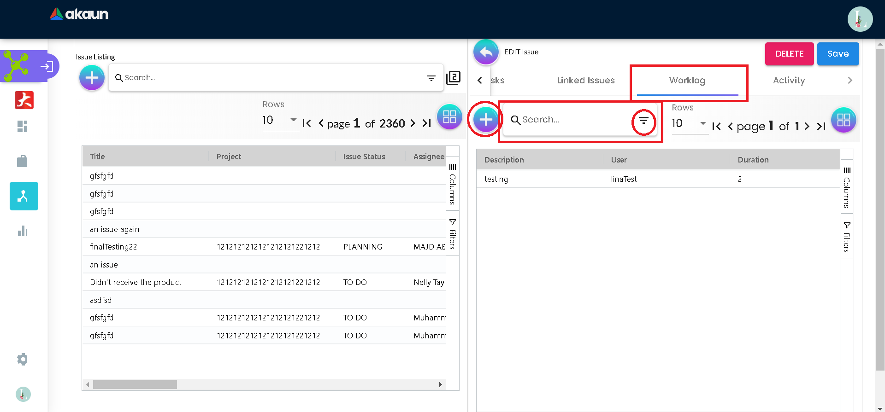

_Issues:_ Worklog _Tab_

On the worklog tab, you can log what you do and how much you spend doing
it. You can search for a worklog by the worklog description. You can
create, or add a worklog to the issue by clicking on the + button.

==== *2.3.2.7.1 Add*

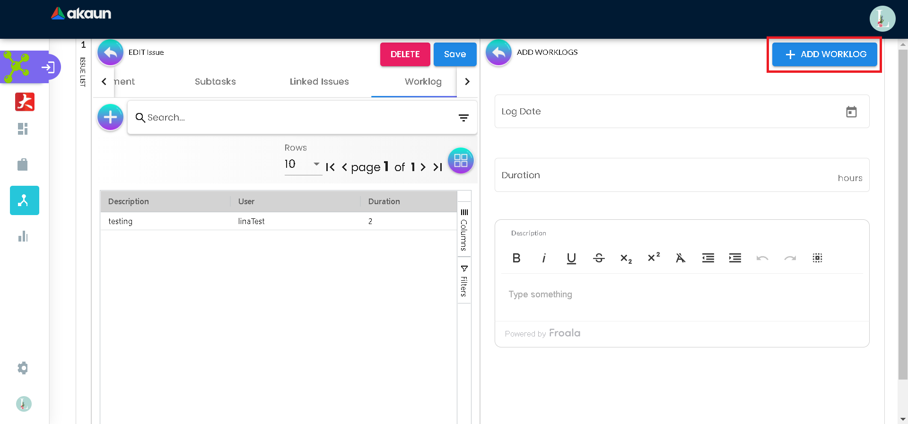

_Issues:_ Worklog _Add Tab_

On the worklog add linked issues, you can log a new worklog by adding
the log date, duration, and description.

==== *2.3.2.7.2 Edit*

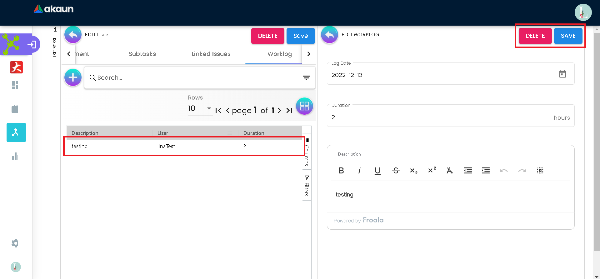

_Issues:_ Worklog _Edit Tab_

You can click on a worklog row to edit the worklog. You can edit the
date, duration, and description. You can also delete a worklog.

==== *2.3.2.8 Activity*

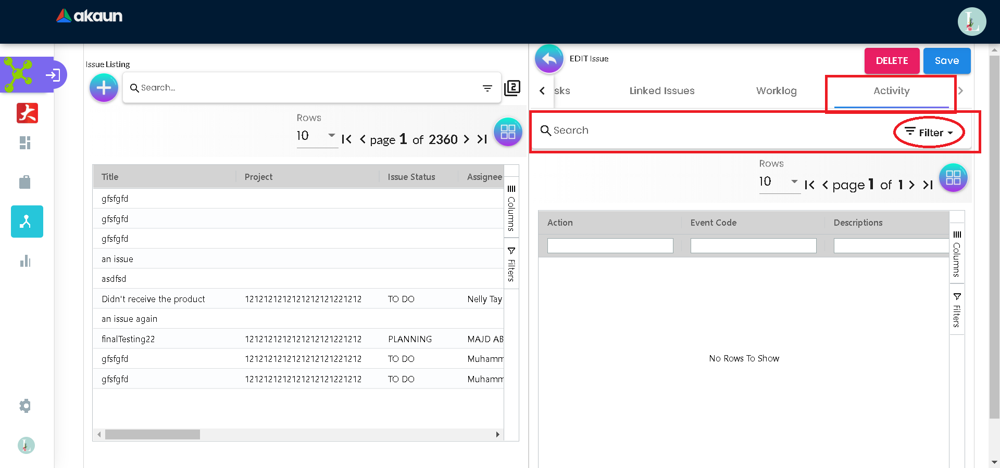

_Issues:_ Activity__Tab__

The Activity tab is used to show all the changes to the current issue.
You can search for specific activities by the action and event code.

=== *2.4 Plans*

The user can create new plans on this page, the user can keep adding
more details to their plan until they finally want to convert the plan
to the project.

