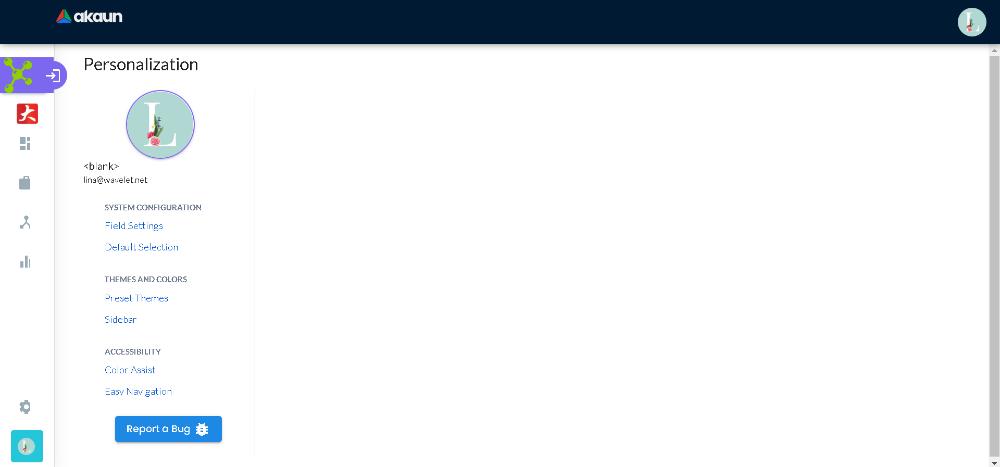
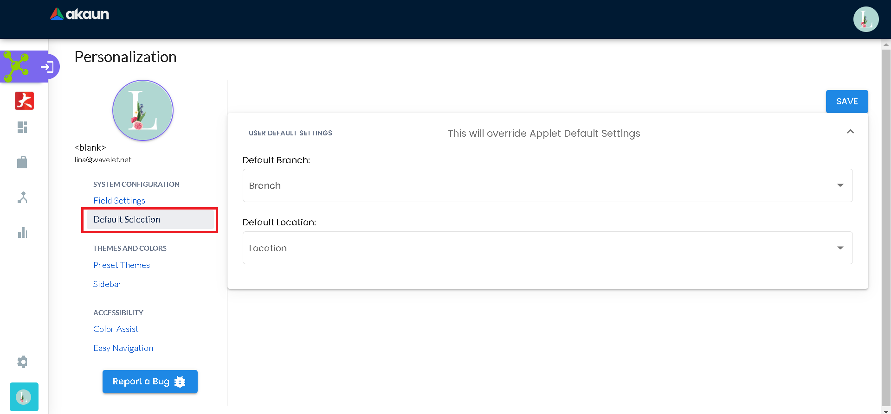
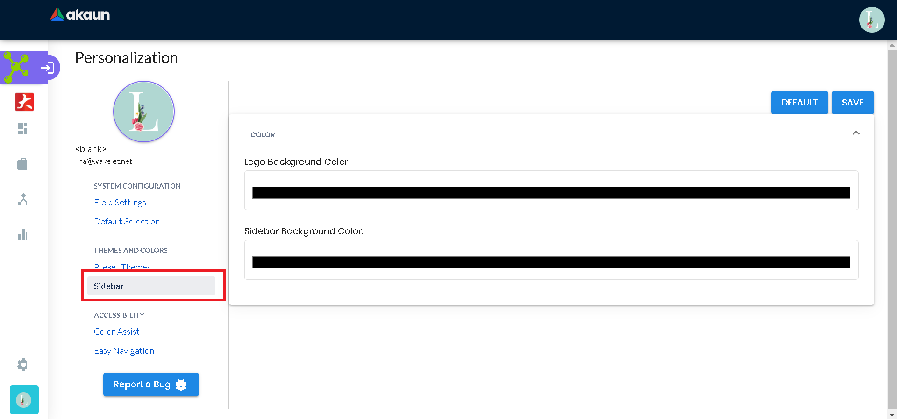

=== *2.6 Personalization*

_Issues:_ Personalization _Page_

The Personalization Page has multiple pages, Field Settings, Default
Selection THEMES AND COLORS, Preset Themes, Sidebar, ACCESSIBILITY,
Color Assist, and Easy Navigation. Also, you can report a bug.

*2.6.1 Default Selection*

_Issues:_ Personalization _Default Selection Page_

You can select the default branch and location on this page.

*2.6.2 Sidebar*

_Issues:_ Personalization Sidebar _Page_

You can select Logo Background Color and Sidebar Background Color on
this page.
