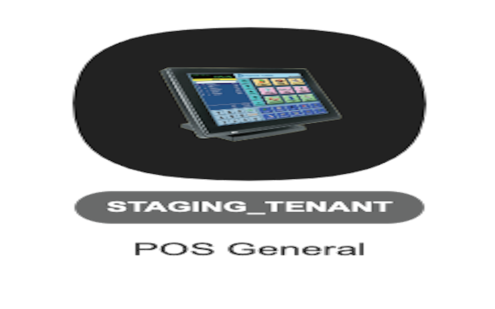

[#h3_pos_introduction]
=  Introduction

This applet is used to manage the payment of products and services at a store. There are three modules in the applet which are Cash Bill, Cashier Collection and Z Report. This applet allows users to create Cash Bill, view the Cashier Report and Z Report. Users are able to export the Z Report to PDF format.
Steps: Create, Edit & Hold Cash Bill > View Cashier Collection Report > View and Export Z Report 
Settings: Add New Settlement Method
